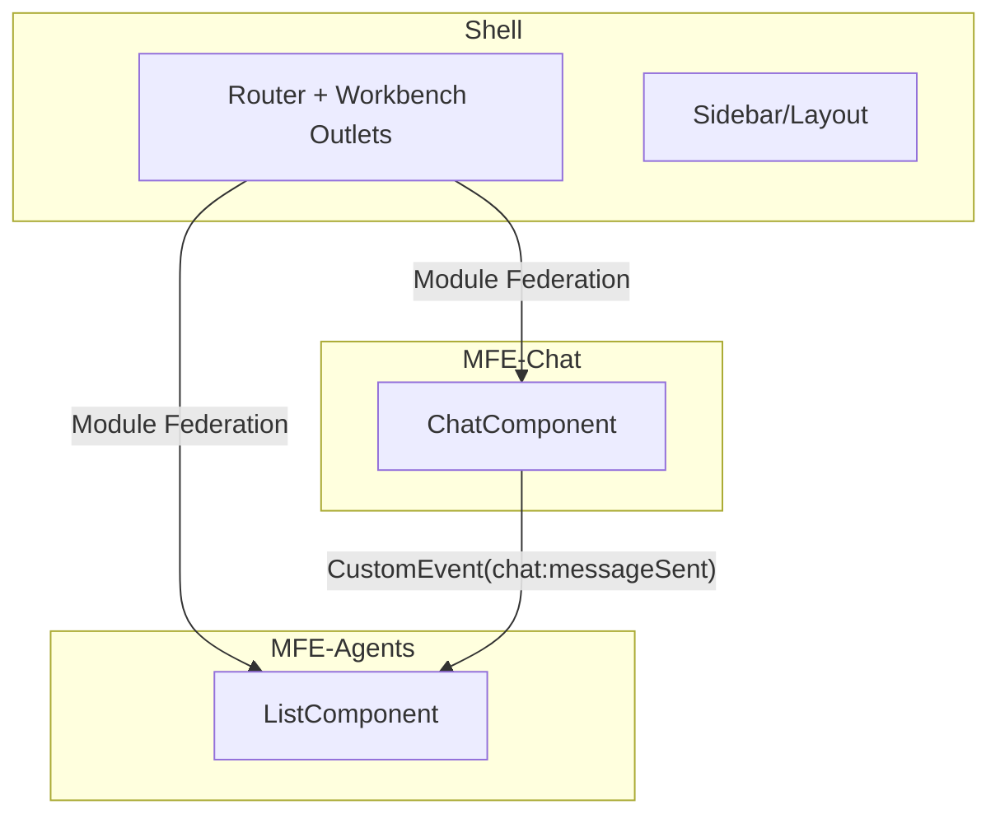

# NeuroDash

Plataforma com Micro Frontends (Angular) organizada em monorepo Nx, seguindo princípios de Arquitetura Hexagonal (Ports & Adapters) nas MFEs, com orquestração via Module Federation.

## Tecnologias
- Angular 16, RxJS 7, SCSS
- NX Monorepo e Module Federation
- json-server (Mock API)
- Cypress/Jest (setup)

## Projetos (apps)
- `mfe-shell`: container com layout/rotas, workbench com outlets `agents` e `chat` lado a lado
- `mfe-agents`: lista de agentes (grid), cálculo de métricas na UI
- `mfe-chat`: chat por agente, envio/recebimento simulado, integração por eventos

## Organização (Hexagonal nas MFEs)
Estrutura típica por MFE (ex.: `mfe-chat`):
- `core/domain`: entidades, enums, contratos de domínio
- `core/application`: ports, services, use-cases, adapters (conversão DTO/HTTP)
- `core/infrastructure`: repositories/concrete adapters, DI tokens/providers
- `core/presentation`: components Angular (UI), rotas e estilos

Princípios aplicados:
- Domínio isolado (sem dependência de Angular)
- Application depende do domínio e define ports
- Infrastructure implementa ports/adapters
- Presentation injeta services/ports via DI, sem conhecer infraestrutura

## Diagrama (Arquitetura Hexagonal por MFE)
```mermaid
flowchart LR
  UI[Presentation (Angular Components)] --> APP[Application Services / Use Cases]
  APP -->|Ports| PORTS[(Ports)]
  ADP[Adapters/Infra (HTTP/Repo)] -->|Implements| PORTS
  APP --> DOM[Domain (Entities/Enums)]
  UI --> DOM
```

## Arquitetura Geral (MFEs + Shell)


## Comunicação entre MFEs
- Evento global do `window` para sincronizar Chat → Lista (baixo acoplamento, sem imports cruzados):
  - `chat:messageSent` (detail: `{ agentId, status, lastActivity, sender, timestamp }`)
- `mfe-agents` escuta com `fromEvent(window, 'chat:messageSent')` e atualiza somente a linha do agente correspondente, executando em `NgZone` para refletir na UI.

## Polling e Atualizações de Estado
- Estado do agente (status/última atividade) e média de resposta são atualizados por eventos do chat (sem polling de rede).
- Cálculo de média de resposta na UI (simples e determinístico):
  - Armazena `lastUserMessageAtByAgent[agentId]` ao enviar mensagem
  - Ao receber resposta, calcula `deltaSeconds = (resposta - última mensagem do usuário)`
  - Mantém `sum` e `count` por agente e exibe `Math.round(sum/count)`

## Como rodar
```bash
npm install
npm run serve:all-with-mock
# abre: shell 4200, agents 4201, chat 4202, mock 3001
```

## Organização de pastas (resumo)
```
apps/
  mfe-shell/
  mfe-agents/
  mfe-chat/
mock-api/
```

## Decisões Importantes
- Evita import cross-MFE; contratos/eventos são consumidos via `window` (pode evoluir para `BroadcastChannel`)
- Enums/entidades locais por MFE para reduzir acoplamento (pode migrar tipos comuns para `libs/contracts`)
- Cálculo de métricas na apresentação (pode migrar para service de aplicação se necessário)

