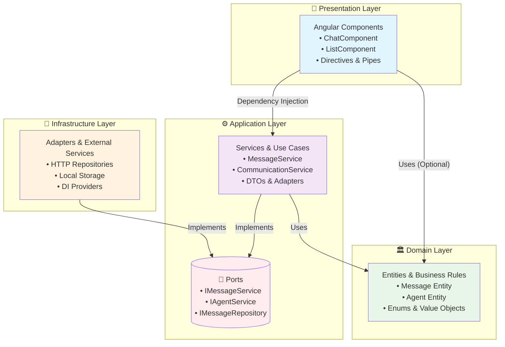
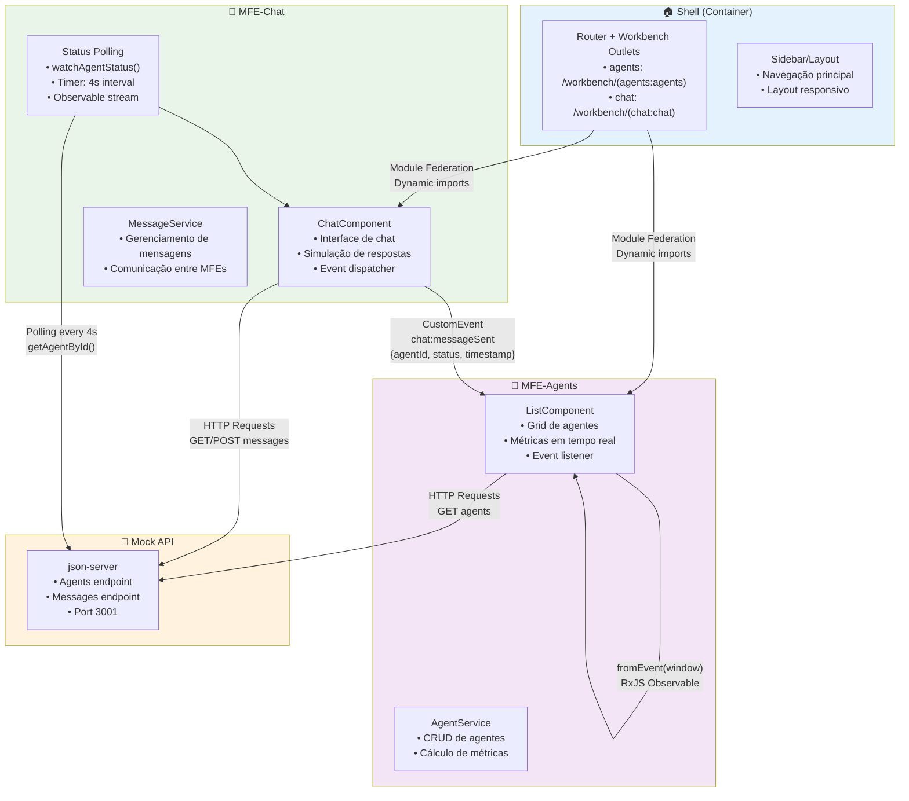

# NeuroDash

Plataforma com Micro Frontends (Angular) organizada em monorepo Nx, seguindo princípios de Arquitetura Hexagonal (Ports & Adapters) nas MFEs, com orquestração via Module Federation.

## Tecnologias
- Angular 16, RxJS 7, SCSS
- NX Monorepo e Module Federation
- json-server (Mock API)
- Cypress/Jest (setup)

## Projetos (apps)
- `mfe-shell`: container com layout/rotas, workbench com outlets `agents` e `chat` lado a lado
- `mfe-agents`: lista de agentes (grid), cálculo de métricas na UI
- `mfe-chat`: chat por agente, envio/recebimento simulado, integração por eventos

## Organização (Arquitetura Hexagonal nas MFEs)

### Estrutura por Camadas

Cada MFE (`mfe-agents`, `mfe-chat`) segue a arquitetura hexagonal com a seguinte organização:

#### 🏛️ **Domain Layer** (`core/domain/`)
- **Entidades**: modelos de negócio puros (ex: `Agent`, `Message`)
- **Enums**: constantes de domínio (ex: `AgentStatus`, `MessageType`)
- **Value Objects**: objetos imutáveis com lógica de negócio
- **Contratos**: interfaces de domínio (ex: `IAgentRepository`, `IMessageRepository`)
- **Regras de Negócio**: validações e cálculos específicos do domínio

#### ⚙️ **Application Layer** (`core/application/`)
- **Ports**: interfaces que definem contratos (ex: `IAgentService`, `IMessageService`)
- **Services**: implementações dos casos de uso e lógica de aplicação
- **Use Cases**: orquestração de operações complexas
- **DTOs**: objetos de transferência de dados
- **Adapters**: conversão entre DTOs e entidades de domínio

#### 🔌 **Infrastructure Layer** (`core/infrastructure/`)
- **Repositories**: implementações concretas dos ports de domínio
- **HTTP Clients**: comunicação com APIs externas
- **Storage**: persistência local (localStorage, IndexedDB)
- **DI Providers**: configuração de injeção de dependência
- **External Services**: integração com bibliotecas externas

#### 🎨 **Presentation Layer** (`core/presentation/`)
- **Components**: componentes Angular (UI)
- **Routes**: configuração de rotas
- **Styles**: SCSS e estilos específicos
- **Directives**: diretivas customizadas
- **Pipes**: transformadores de dados para apresentação

### Princípios Aplicados

#### 🔄 **Inversão de Dependência**
```typescript
// ❌ Ruim: Presentation conhece Infrastructure
constructor(private httpClient: HttpClient) {}

// ✅ Bom: Presentation depende apenas de Ports
constructor(private messageService: IMessageService) {}
```

#### 🏝️ **Isolamento do Domínio**
- Domain não possui dependências externas
- Zero imports de Angular ou bibliotecas externas
- Regras de negócio puras e testáveis

#### 🔌 **Ports & Adapters**
- **Ports**: interfaces que definem o que a aplicação precisa
- **Adapters**: implementações que conectam com o mundo externo
- **Flexibilidade**: trocar adapters sem afetar o domínio

#### 📦 **Injeção de Dependência**
```typescript
// providers.ts
export const providers = [
  { provide: IMessageService, useClass: MessageService },
  { provide: IMessageRepository, useClass: MessageRepository }
];
```

### Exemplo Prático (mfe-chat)

```
mfe-chat/src/app/core/
├── domain/
│   ├── entities/
│   │   ├── message.entity.ts      # Message(id, content, timestamp, agentId)
│   │   └── agent.entity.ts        # Agent(id, name, status)
│   ├── enums/
│   │   ├── message-type.enum.ts   # USER, AGENT, SYSTEM
│   │   └── agent-status.enum.ts   # ONLINE, OFFLINE, BUSY
│   └── contracts/
│       ├── message.repository.ts  # IMessageRepository
│       └── message.service.ts     # IMessageService
├── application/
│   ├── services/
│   │   ├── message.service.ts     # Implementa IMessageService
│   │   └── communication.service.ts # Comunicação entre MFEs
│   ├── ports/
│   │   └── message.port.ts        # Define contratos
│   └── adapters/
│       └── message.adapter.ts     # Conversão DTO ↔ Entity
├── infrastructure/
│   ├── repositories/
│   │   └── message.repository.ts  # Implementa IMessageRepository
│   └── providers/
│       └── di.providers.ts        # Configuração DI
└── presentation/
    ├── features/
    │   └── chat/
    │       ├── chat.component.ts  # UI Component
    │       ├── chat.component.html
    │       └── chat.component.scss
    └── shared/
        └── message-list/
            └── message-list.component.ts
```

### Benefícios da Arquitetura Hexagonal

1. **🧪 Testabilidade**: Domain e Application são facilmente testáveis
2. **🔄 Flexibilidade**: Trocar implementações sem afetar o domínio
3. **📈 Escalabilidade**: Adicionar novos adapters sem modificar o core
4. **🔧 Manutenibilidade**: Separação clara de responsabilidades
5. **🚀 Desenvolvimento**: Equipes podem trabalhar em camadas independentes

## Diagrama (Arquitetura Hexagonal por MFE)


## Arquitetura Geral (MFEs + Shell)


## 🔄 Comunicação entre MFEs

### Event-Driven Architecture
- **Evento Global**: `chat:messageSent` via `window.dispatchEvent()`
- **Payload**: `{ agentId, status, lastActivity, sender, timestamp }`
- **Baixo Acoplamento**: Sem imports cruzados entre MFEs

### Fluxo de Comunicação
```typescript
// mfe-chat: Dispara evento
window.dispatchEvent(new CustomEvent('chat:messageSent', { 
  detail: { agentId, status: 'busy', lastActivity: new Date() } 
}));

// mfe-agents: Escuta evento
fromEvent<CustomEvent>(window, 'chat:messageSent').subscribe(event => {
  const { agentId, status, lastActivity } = event.detail;
  this.updateAgentFromPayload(agentId, status, lastActivity);
});
```

## ⏱️ Polling e Atualizações de Estado

### Polling de Status do Agente
```typescript
// AgentService.watchAgentStatus()
public watchAgentStatus(id: string, intervalMs = 4000): Observable<AgentStatus> {
  return timer(0, intervalMs).pipe(
    switchMap(() => this.getAgentById(id)),
    map(agent => agent?.status ?? AgentStatus.OFFLINE),
    distinctUntilChanged(),
    shareReplay({ bufferSize: 1, refCount: true })
  );
}
```

**Características do Polling:**
- ⏰ **Intervalo**: 4 segundos (configurável)
- 🔄 **Observable Stream**: RxJS com `timer()`
- 🎯 **DistinctUntilChanged**: Evita emissões desnecessárias
- 📦 **ShareReplay**: Cache do último valor para múltiplos subscribers

### Cálculo de Métricas em Tempo Real

#### 📊 Média de Tempo de Resposta
```typescript
// Armazena timestamp da mensagem do usuário
this.lastUserMessageAtByAgent[agentId] = Date.now();

// Calcula delta quando agente responde
const deltaSeconds = Math.round((agentResponseTime - userMessageTime) / 1000);
this.responseSumSecondsByAgent[agentId] += deltaSeconds;
this.responseCountByAgent[agentId] += 1;
const average = Math.round(sum / count);
```

#### 📈 Atualizações de Estado
- **Status**: ONLINE → BUSY → ONLINE (baseado em eventos)
- **LastActivity**: Atualizado a cada interação
- **Métricas**: Calculadas em tempo real na UI
- **NgZone**: Garante atualização da interface

### 🚫 Sem Polling de Rede Desnecessário
- Estado atualizado via **eventos**, não polling
- Polling apenas para **status do agente** (4s)
- Métricas calculadas **localmente** na apresentação
- **Performance otimizada** com RxJS operators

## Como rodar
```bash
npm install
npm run serve:all-with-mock
# abre: shell 4200, agents 4201, chat 4202, mock 3001
```

## Organização de pastas (resumo)
```
apps/
  mfe-shell/
  mfe-agents/
  mfe-chat/
mock-api/
```

## Decisões Importantes
- Evita import cross-MFE; contratos/eventos são consumidos via `window` (pode evoluir para `BroadcastChannel`)
- Enums/entidades locais por MFE para reduzir acoplamento (pode migrar tipos comuns para `libs/contracts`)
- Cálculo de métricas na apresentação (pode migrar para service de aplicação se necessário)

